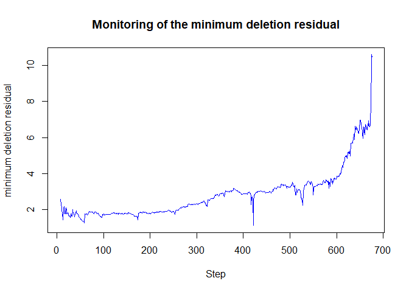

<!-- README.md is generated from README.Rmd. Please edit that file -->

# fsdac

This is a package to demonstrate the development of an R package using
native C code generated by the MATLAB Coder. The function translated so
far and included in the package are: addt(), FSR(), LXS(), FSRfan(),
FSRbsb(), FSRmdr().

## Installation

You can install ‘fsdac’ from github with:

``` r
# install.packages("remotes")
remotes::install_github("UniprJRC/FSDA-MATLAB_Coder", subdir="R-package", INSTALL_opts=c("--no-multiarch"))
```

## Example

This is a basic example which shows you if the package is properly
installed:

``` r

library(fsdac)
##  FSR with all default options =================================
    n <- 200
    p <- 3
    set.seed(123456)
    X <- matrix(rnorm(n*p), nrow=n)

##  Uncontaminated data
    y <- rnorm(n)

##  Contaminated data
    ycont <- y
    ycont[1:5] <- ycont[1:5] + 6
    (out <- FSR(ycont, X))
#> Signal in final part of the search: step 195 because
#> rmin(195,200)>99.9% and rmin(196,200)>99.9% and rmin(194,200)>99%
#> rmin(195,200)>99% at final step: Bonferroni signal in the final part of the search.
#> rmin(195,200)>99.999%
#> ------------------------------------------------
#> -------------------
#> 
#> Call:
#> FSR(y = ycont, x = X)
#> 
#> Coefficients:
#> [1]  -0.063295   0.114162   0.008352   0.049730
#> 
#> Scale estimate 0.989
```

## Another example with the new function FSRmdr()

``` r
    library(fsdac)
    data(fishery)

    y <- fishery[,2, drop=FALSE]
    X <- fishery[,1, drop=FALSE]
    out <- LXS(y, X, nsamp=10000)
#> Total estimated time to complete LTS:  0.42 seconds
    bsb <- out$bs
    ## bsb <- c(371, 450)                       # found by LTS

    out <- FSRmdr(y, X, bsb)                   # call 'FSRmdr' with all default parameters
    plot(out)
```

<!-- -->

``` r

    out <- FSRmdr(y, X)                         # call 'FSRmdr' with missing bsb - will start from random p-sample
    out <- FSRmdr(y, X, bsb, init=60)           # Example with monitoring from step 60.
    out <- FSRmdr(y, X, bsb, intercept=FALSE)   # Regression without intercept
    out <- FSRmdr(y, X, bsb, nocheck=TRUE)      # No checks on y and X (and no intercept)
```
